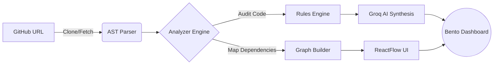

<div align="center">

# 🧿 Kenshō
**The Intelligence Engine for Codebases**

An advanced, AST-driven repository analyzer that doesn't just scan code—it *understands* it.

<p align="center">
  
  
  
  
  
  
</p>

[Features](#-key-features) • [Architecture](#-architecture--workflow) • [Tech Stack](#-tech-stack) • [Installation](#-getting-started)

</div>

---

> **Kenshō** (Japanese for *"seeing one's true nature"*) takes a raw GitHub repository and instantly reverse-engineers it into a living, interactive architectural map. It highlights structural dependencies, uncovers deep-rooted bottlenecks, and uses high-speed AI to explain the codebase like a senior staff engineer.

---

## ⚡ The Problem

Modern developers waste countless hours trying to mentally map alien codebases. Hunting down hidden architectural bottlenecks (like N+1 queries) or pinpointing fragile UI logic is slow, error-prone, and frustrating. 

**Naive regex scanning isn't enough.** We needed a tool that natively parses the **AST (Abstract Syntax Tree)** to understand how files, functions, and services genuinely intertwine.

---

## ✨ Key Features

| Feature | Description |
| :--- | :--- |
| **🧬 Interactive AST Mapping** | Visualizes the entire architecture using `React Flow` & `Dagre` for automated Left-to-Right hierarchical graph layouts. |
| **⚡ Performance Audits** | Identifies slow patterns, N+1 queries in ORMs, and bloated component lifecycles instantly. |
| **🐛 Risk Scanner** | Performs deterministic code audits to flag missing `try/catch` blocks and high-risk structural flaws. |
| **🤖 Groq AI Synthesis** | Analyzes the generated graph and matched rules to provide actionable, sub-second, plain-English explanations. |
| **💾 Edge Caching** | Lightning-fast history reload of previously analyzed repositories using deeply optimized state management. |

---

## 🏗 Architecture & Workflow

Kenshō utilizes a multi-stage pipeline to analyze code at blinding speeds:



---

## 💻 Tech Stack

Engineered for extreme performance and a hyper-premium Developer Experience (DX).

<details>
<summary><b>Frontend Architecture</b> <i>(Click to expand)</i></summary>

- **Core**: Next.js 16.2.4 (Turbopack) & React Server Components
- **Styling**: Tailwind CSS v4 (Hyper-premium dark "hacker" aesthetic, backdrop-blur, bento-grids)
- **Animations**: Framer Motion (Staggered reveals, micro-interactions, layout transitions)
- **Data Visualization**: React Flow & Dagre (Directed graph mapping)
- **Iconography**: Lucide React
</details>

<details>
<summary><b>Backend & Analysis Layer</b> <i>(Click to expand)</i></summary>

- **Code Intelligence**: Custom Regex & AST Parsing logic
- **AI Processing**: Groq LLM (For record-breaking explanation speeds)
- **Data Ingestion**: GitHub REST API
</details>

---

## 🚀 Getting Started

Ready to run Kenshō locally? Follow these steps to spin up the intelligence engine.

### 1. Clone the Repository
```bash
git clone https://github.com/StarDust130/Kensho.git
cd kensho
```

### 2. Install Dependencies
```bash
npm install
```

### 3. Environment Configuration
Create a `.env.local` file in the root directory and add your API keys:
```env
# Required for AI Synthesis
GROQ_API_KEY=your_groq_api_key_here

# Highly Recommended (Bypasses GitHub unauthenticated rate limits)
GITHUB_TOKEN=your_github_personal_access_token
```

### 4. Ignite the Engine
```bash
npm run dev
```

> **Note:** Visit `http://localhost:3000` in your browser. Paste any public GitHub repository URL into the terminal prompt to begin analysis.

---

<div align="center">
  <p>Engineered with 🥷 precision and ⚡ speed for the modern developer.</p>
</div>
